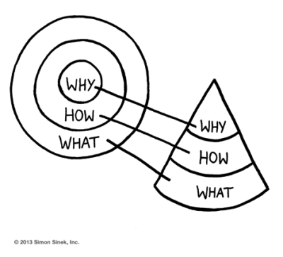

<!-- markdownlint-disable MD033 -->

# The Golden Circle, Start with Why
It doesn’t matter what you do, it matters why you do it. — Simon Sinek "Quotes"

Soon after I redesigned our logo focusing on the 3 circles, I bought my next audiobook for my mobile library, “Start With Why,” by Simon Sinek.

<figure class="figure">
    
    <figcaption class="figure__caption">Golden Circle</figcaption>
</figure>

In his book, Simon describes The Golden Circle, What, How, Why. The Why is the inner circle, the How is the middle and the What is the outer circle. The concept is based on the belief that people believe why you do it, not what you do. You work from the inside out, starting with Why, your purpose. Traditionally, companies have worked from the outside in, starting with *what* they do, the result. Everyone knows what they do, even *how* they do it, but few really know *why* they do it.

1. *Why* = your purpose. The reason why you do what you do.
2. *How* = your process. How you are going to realize your why, the actions needed to make your why a reality.
3. *What* = your result. What you do, your product or service as a result of your why.

The Golden Circle fits our mission and expands the purpose of The Business Helper and our services. We help define your purpose, your process and your result. Whether you know one or all three, or none, we help clarify and create a process for your Why, How and What.

The Golden Circle is another symbolic representation of The Business Helper’s logo redesign.

Find out more about Simon Sinek and spread the Why:

1. [Golden Circle slides](https://gumroad.com/simonsinek)
2. [Ted Talk (long version)](https://www.ted.com/talks/simon_sinek_how_great_leaders_inspire_action?language=en)
3. [Ted Talk (edited, short version)](https://www.youtube.com/watch?v=IPYeCltXpxw&feature=youtu.be)
4. [If You Don’t Understand People, You Don’t Understand Business](https://vimeo.com/26774102)