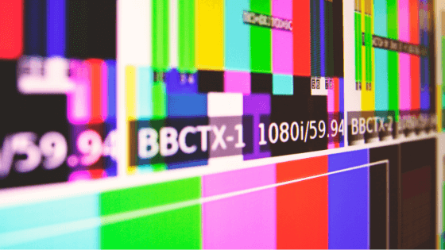

<!-- markdownlint-disable MD033 -->

<figure class="figure">
    
</figure>

A video wall is made up of a number of screens, each acting as tiles, that are used to project large images onto a background. Video walls are used in a number of capacities, from advertising and instruction to the obvious application of using them to project films as entertainment for the public.  
However, video walls have increasingly been used in the world of business in order to help boost a businesses profile and in order to change the way a business operates. There is a lot of evidence that video walls can help boost your business, and below are a few suggestions of how you can use them to boost your business.

### They can help you to get your business out there
Video walls can be an ultra visual way to get your business noticed, and to increase the visual presence of your company. This is for two reasons. Firstly, video walls allow your message to be projected on a large screen. That’s obvious. Secondly, it’s at the forefront of technology, and so it will get you noticed. Video walls can help create a buzz through word of mouth, and they will help get people talking about your business, and, of course, your product.

### Your customers can interact with your business in new and exciting ways
One of the most exciting things about video walls, particularly from the perspective of a businessperson, is there interactive capability. They’re often touch screens, and therefore your customers can interact with your advertising or information in a way that was not possible a mere decade ago. For example, through their sheer visual power, a video wall will get a prototype product out to a wider audience. As well as being able to ask for customer feedback with questions such as: Do they like it? What would they change? This can allow businesses to be a much more collaborative enterprise, which of course will make your customers happier.

### They can allow you to create more fluid advertising
The only sure thing in business is that consumer tastes change. Advertising therefore has to change with them. Traditional print advertising (the type found on billboards and in magazines) does not often keep pace with consumer demands, new tastes and trends. Video walls, however, can be the opposite. Every trends, every change, can be tracked and your advertising can take account of this. Whole advertising campaigns can be changed by the click of a mouse.

### They can help you to run your business in more innovative ways
There are a host of ways in which a business can be grown through merely changing the way in which your staff operate. For example, video walls can have a profound positive effect on staff meetings, on remote working and on collaboration. If you use the full features of a video wall, your staff meetings will become more creative and interactive, and your employees will come up with fresher, more innovative ideas. In short, with one small change, you will have a more collaborative work environment.

 Technology is forever changing. However, the one constant is that technology is here to stay. We can’t promise you that your business will be the next Amazon or Apple if you utilize video wall technology. However, it can’t hurt!