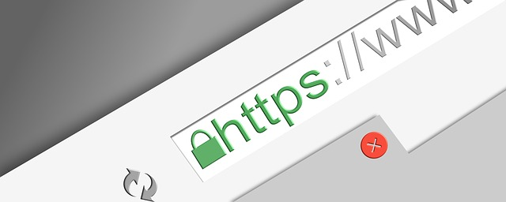

<!-- markdownlint-disable MD033 -->

# 5 Reasons Your Site Should Be HTTPS

<figure class="figure">
    
    <figcaption class="figure__caption">http-security</figcaption>
</figure>

The difference between HTTP and HTTPS may only be one letter, but that one letter can have a huge impact in your website’s performance. What is HTTPS and what does it mean for your small business.

## What Is HTTPS?

HTTPS is a way to encrypt information that you send between a browser and a web server. This protects your website’s users from attacks intercepted by a middleman, where someone steals the information being sent to a website, like credit card information or logins.

Historically, HTTPS connections have primarily been used for sites that contain sensitive information, but recently, more sites are making the switch especially since Google prefer secure sites and are marking those with no SSL certificates as Not Secure.  As HTTPS has become easier to implement, secure connections are becoming the standard for all websites.

## What Is an SSL Certificate?

An SSL Certificate is a set of data files that you can add to your server to achieve an encrypted connection between a browser and your server. When installed, a green padlock will be displayed when users visit your site to indicate that the site is secure.

## What’s the Difference Between SSL and HTTPS?

You may have heard the terms “SSL” or “SSL Certificate” used interchangeably with HTTPS.  For the most part, these are the same. An SSL certificate is the product that you are actually purchasing and installing on your server, and HTTPS is the result of having that certificate on your server.

*IF YOUR WEBSITE ISN’T SECURE YET, IT DEFINITELY SHOULD BE. HERE’S WHY:*

    1. Increased Google Rankings
Google has confirmed that they favour HTTPS sites and not surprisingly, over 40% of the sites on the first page of Google are HTTPS.

Google wants to ensure the best user experience for their customers, so understandably they don’t want to send searchers to insecure sites. Because of that, their ranking algorithm favours HTTPS sites. If your site isn’t secure, it could be getting outranked by similar sites that are. 

    2. Improved Security
There’s a reason why Google favours HTTPS—they want to achieve the safest web experience for their users. HTTPS protects your users’ information and your information from hackers.

Keeping everything safer and more secure is simply a better option for everyone.

    3. Updated Browser Labels
As part of their push for a more secure web, Google is also updating their labelling for HTTP sites in Chrome’s URL bar. Currently, HTTP sites are marked with a grey information symbol and include a “Not Secure” label that is displayed in browser bar advising the user of the site security status. Eventually, Google is going to mark http sites with a red triangle with a “Not Secure” label written in red.

While this new label only means that your site is not HTTPS, users don’t fully understand that, and many will likely feel a sense of unease from seeing that label on a site they are browsing.

    4. Increased Conversions
While users may not have a complete technical understanding of secure connections, they do understand that they want a site to be HTTPS if they are providing personal information.

There is already a difference in conversion rates between HTTP and HTTPS sites and as Google rolls out their new HTTP labelling, we will likely see an even larger difference in conversion rates between the two.

When users see those red labels, something as simple as entering a name, email, and phone number into a basic lead generation form can cause them concern.

    5. Increased Customer Confidence
With all the discussion of Google search results placing importance on HTTPS sites going around, more users are looking for a secure connection when visiting a website. A secure connection gives your customers peace of mind that your website can be trusted and their information is safe.  
  
#### HOW DO YOU SWITCH YOUR SITE TO HTTPS?

If you’re ready to make the switch the HTTPS, Your Business Helper can handle the migration process for you – Contact Us Now to get your site secured!